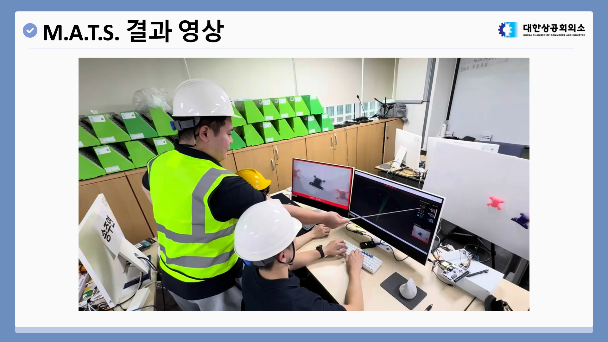
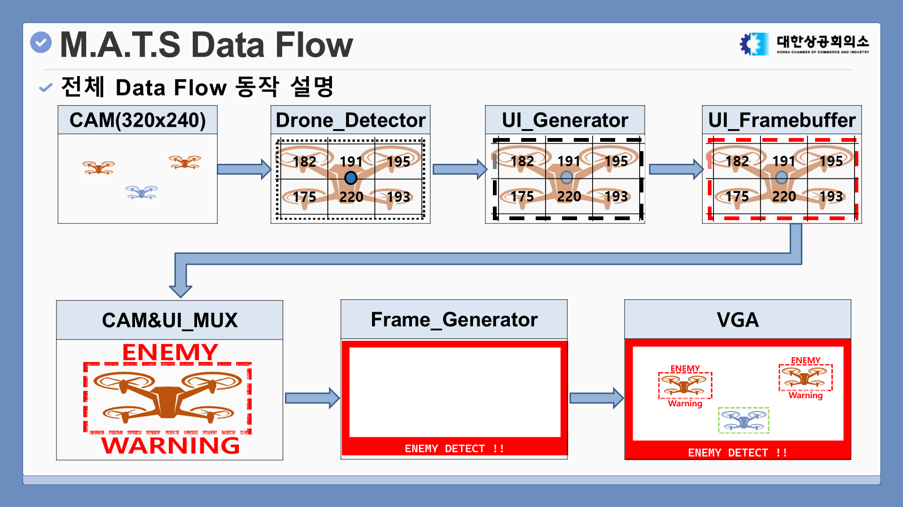
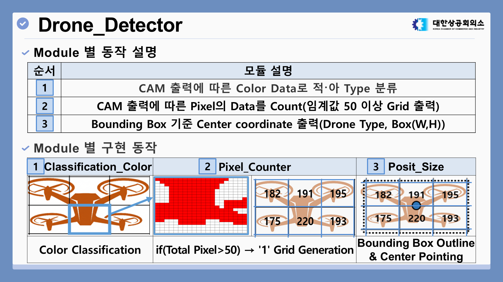
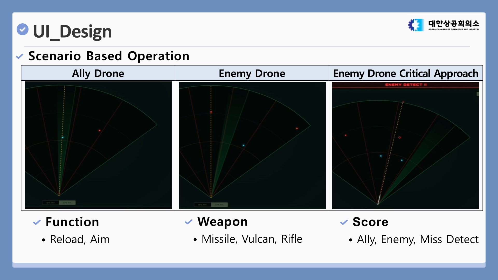
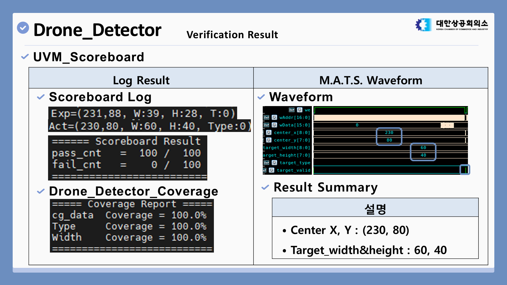

# M.A.T.S. Anti-Drone System

### Mobile Autonomous Targeting System - 기동형 자율 조준 및 타겟 시스템

M.A.T.S.는 FPGA 기반의 실시간 안티드론 탐지 및 조준 시스템입니다. OV7670
카메라로 입력되는 영상을 실시간으로 처리하고, 색상 기반 분류를 통해 아군과
적군 드론을 판별합니다. 이후 VGA 화면에 경고 UI를 오버레이하고, 탐지된
타겟의 좌표 정보를 UART를 통해 PC 관제 UI로 전송합니다.

> 대한상공회의소 서울기술교육센터 온디바이스 AI 반도체 설계 1기 미니 프로젝트  
> 개발 기간: 2026.07.13 - 2026.07.21



## 프로젝트 개요

저비용 드론을 활용한 비대칭 위협이 증가하면서, 작전 구역 안으로 접근하는
드론을 빠르게 탐지하고 대응할 수 있는 안티드론 시스템의 필요성이 커지고
있습니다.

본 프로젝트는 카메라 입력부터 객체 탐지, VGA 출력, PC 모니터링까지 이어지는
탐지 파이프라인을 FPGA 로직으로 구현하는 것을 목표로 했습니다.

주요 목표:

- 실시간 카메라 영상에서 아군 및 적군 드론 객체 탐지
- 320x240 화면을 16x12 Grid로 분할하여 안정적인 타겟 위치 산출
- Bounding Box, Warning Label, 상태 Frame을 VGA 화면에 오버레이
- UART를 통해 타겟 Type, 중심 좌표, 크기 정보를 PC UI로 전송
- 시뮬레이션 기반으로 탐지 및 UI 생성 로직 검증

## 시스템 흐름



시스템은 카메라 픽셀 데이터를 하드웨어 파이프라인으로 처리합니다.
`Drone_Detector`는 색상 정보를 기반으로 타겟을 분류하고 위치를 계산합니다.
`UI_Generator`는 탐지 결과를 화면 출력용 좌표와 명령으로 변환하며,
`UI_Framebuffer`는 오버레이 픽셀을 압축 저장합니다. 마지막으로
`Frame_Generator`가 경고 프레임과 텍스트를 합성하여 VGA로 출력합니다.

## 디렉토리 구조

```text
.
+-- HW_MATS/
|   +-- src/RTL/
|   |   +-- CAM_Set/
|   |   +-- UI_Set/
|   |   +-- Frame_Set/
|   |   +-- UART_Set/
|   |   +-- TOP_sys.sv
|   |   +-- VGA_Decoder.sv
|   +-- sim/
|   +-- constraint/
+-- SW_MATS/
    +-- gui_app.py
    +-- uart_receiver.py
    +-- web/index.html
```

## 하드웨어 설계

### Drone Detector



`Drone_Detector`는 카메라에서 들어온 픽셀 데이터를 분석하여 타겟의 종류와
위치를 산출합니다. 색상 분류, Grid 기반 픽셀 카운팅, Bounding Box 계산을
거쳐 타겟 Type, 중심 좌표, Width, Height 정보를 출력합니다.

핵심 모듈:

- `Drone_Classification_Color`: 적군 및 아군 색상 영역 분류
- `Drone_pixel_counter`: 16x12 Grid 내부의 픽셀 누적 카운팅
- `Drone_posit_size`: 활성 Grid 영역 병합 및 타겟 위치와 크기 계산

### UI Generator 및 Framebuffer

`UI_Generator`는 `Drone_Detector`에서 전달받은 타겟 좌표와 크기 정보를 기반으로
점선 Bounding Box와 타겟 Label을 그리기 위한 픽셀 좌표를 생성합니다.

`UI_Framebuffer`는 전체 화면 UI 정보를 12-bit RGB로 저장하지 않고 2-bit Bitmap
형태로 압축 저장합니다. 이를 통해 BRAM 사용량을 줄이면서도 실시간 UI
오버레이를 유지할 수 있도록 설계했습니다.

### VGA 및 UART 출력

최종 화면은 카메라 원본 영상, UI 오버레이, 경고 프레임, 상태 텍스트를 합성해
VGA로 출력합니다. 동시에 UART 경로를 통해 동일한 탐지 결과를 PC 프로그램으로
전송하여 레이더 형태의 관제 UI에서 확인할 수 있도록 했습니다.

## PC 관제 UI



PC UI는 UART로 수신한 타겟 정보를 전술 레이더 화면처럼 시각화합니다. 아군
드론, 적군 드론, 적군 근접 상황을 구분하여 표시하고 Reload, Aim, 무기 선택,
Score 표시 기능을 제공합니다.

UART Receiver는 6바이트 타겟 패킷을 복원합니다.

```text
Byte 0: {cx[1:0], type[0], eof[0], 4'b1111}
Byte 1: {cy[0], cx[8:2]}
Byte 2: {w[0], cy[7:1]}
Byte 3: {w[8:1]}
Byte 4: {h[7:0]}
Byte 5: 0xFF
```

## 검증



탐지 로직은 랜덤 타겟 트랜잭션을 이용해 검증했습니다. 테스트 환경에서 아군과
적군 타겟의 위치와 크기를 무작위로 생성하고, DUT가 출력한 중심 좌표, 크기,
Type 정보를 Scoreboard에서 비교했습니다.

검증 결과:

- Drone Type, Size, Position 랜덤 트랜잭션 생성
- Monitor와 Scoreboard를 통한 출력 결과 비교
- Scoreboard 결과: `pass_cnt = 100 / 100`
- 주요 Detector 데이터 필드 Coverage: `100.0%`

## 트러블슈팅

초기 탐지 방식은 고정 RGB 임계값을 사용했기 때문에 조명 변화에 따라 오탐지와
미탐지가 발생했습니다. 이를 개선하기 위해 조도와 색상 정보를 분리해서 판단할
수 있는 HSV 기반 판별 방식으로 로직을 보완했습니다.

또한 카메라 접근 임계값과 UART Sampling 주기를 조정하여 VGA 화면의 타겟
오버레이와 PC 레이더 UI의 좌표 표시가 더 안정적으로 맞도록 개선했습니다.

## 실행 방법

### Hardware

1. Vivado에서 프로젝트를 열거나 `HW_MATS/src/RTL`의 RTL 소스를 추가해 새
   프로젝트를 생성합니다.
2. `HW_MATS/constraint`의 Basys3 제약 파일을 추가합니다.
3. Synthesis 및 Implementation을 진행한 뒤 Bitstream을 생성합니다.
4. OV7670 카메라 모듈, VGA 모니터, UART USB Serial 인터페이스를 연결합니다.
5. FPGA 보드에 Bitstream을 Program합니다.

### PC UI

Python 패키지를 설치합니다.

```bash
pip install pyserial pywebview opencv-python
```

GUI 프로그램을 실행합니다.

```bash
python SW_MATS/gui_app.py --port COM5 --baud 115200
```

빌드된 실행 파일을 사용할 수도 있습니다.

```bash
SW_MATS/EXE/gui_app.exe --port COM5 --baud 115200
```

`COM5`는 Windows 장치 관리자에서 확인한 실제 Serial Port 번호에 맞게 변경합니다.

## 기술 스택

- SystemVerilog
- Xilinx Vivado
- OV7670 Camera Module
- VGA Display Pipeline
- UART Serial Communication
- Python GUI
- UVM 기반 검증 흐름

